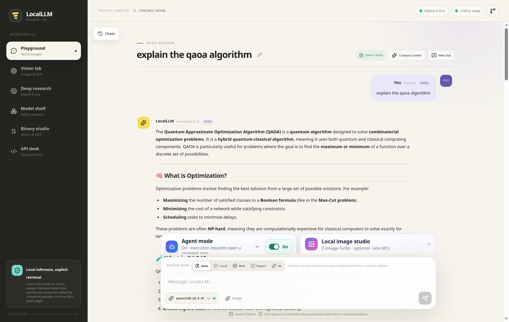

# LocalLLM Studio

> A bright, private control room for local language, vision, deep research, and AI-assisted reverse engineering.

[](apps/web)
[](apps/api)
[](https://github.com/lachlanchen/LocalLLM/actions/workflows/ci.yml)
[](references/openai-api-compatibility.md)
[](#privacy-and-safety)

LocalLLM Studio turns a capable Linux workstation into a coherent local AI system. It pairs a polished responsive web app with Ollama, explicit Qwen model presets, resumable SQLite conversations, a local OpenAI-compatible gateway, bounded cited web research, optional confirmed Python and image-generation lanes, and a Ghidra/MCP reverse-engineering workspace.

The application is useful before every model is downloaded: system diagnostics, model pulls, the built-in API Desk, and bounded static binary inspection remain available independently.

## Playground preview

[](docs/images/qaoa-session.png)

*A resumable QAOA conversation rendered by the local Qwen3 8B model. Open the image for the full 2880 × 1826 capture.*

## What is inside

| Workspace | Purpose |
| --- | --- |
| Playground | Resumable streaming chat, local-first Auto routing, image attachments, GFM/KaTeX rendering, and collapsed Agent/Image capability panels |
| Vision Lab | OCR, screenshot review, diagram reading, and visual question answering |
| Deep Research | Multi-query web search, page extraction, cited synthesis, and uncertainty tracking |
| Model Shelf | Eleven curated Q4/Q8 text, MoE, coding, vision/Vision XL, and embedding tags with download progress, installed state, and stable aliases |
| Binary Studio | Static upload triage plus a read-only Ghidra/MCP investigator with mutation tools blocked |
| API Desk | Copy-ready examples for Chat Completions, Responses, vision inputs, embeddings, and models |

## Quick start

Requirements: Linux x86-64, Node.js 20.19+ or 22.12+, npm, [`uv`](https://docs.astral.sh/uv/), Git, curl, tar, zstd, `sha256sum`, and an NVIDIA driver appropriate for the installed GPU. Binary Studio's host-side static triage uses `file` and `strings`. The reverse-engineering installer additionally preflights Java/Javac 21 and unzip; packet tooling uses Docker without requiring host-level packet packages.

```bash
git clone https://github.com/lachlanchen/LocalLLM.git
cd LocalLLM

scripts/bootstrap.sh
scripts/run.sh
```

Open <http://127.0.0.1:8008>. The default launcher uses this IPv4 loopback endpoint; the app rejects non-loopback peers.

In a second terminal, pull the three practical daily models plus multilingual embeddings (about 32 GB):

```bash
scripts/pull-models.sh core
```

Pull the optional coding specialist by itself (about 19 GB), without changing
the practical `core` baseline:

```bash
scripts/pull-models.sh code
```

Pull all eleven curated Ollama artifacts: every Q4/Q8 comparison model, the
30B-A3B coding and Vision XL models, and multilingual embeddings (about 128 GB):

```bash
scripts/pull-models.sh all
```

## Curated dual-4090 model set

| Role | Artifact | Disk | Stable alias |
| --- | --- | ---: | --- |
| Tiny and fast | `qwen3:4b-q4_K_M` / `qwen3:4b-q8_0` | 2.6 / 4.4 GB | `localllm-pocket` |
| Daily assistant | `qwen3:8b-q4_K_M` / `qwen3:8b-q8_0` | 5.2 / 8.9 GB | `localllm-fast`, `localllm-balanced` |
| Research and RE | `qwen3:30b-a3b-instruct-2507-q4_K_M` / `...q8_0` | 19 / 32 GB | `localllm-deep`, `localllm-max` |
| Coding specialist | `qwen3-coder:30b-a3b-q4_K_M` | 19 GB | `localllm-code` |
| Vision and OCR | `qwen3-vl:8b-instruct-q4_K_M` / `...q8_0` | 6.1 / 9.8 GB | `localllm-vision`, `localllm-vision-max` |
| Vision XL | `qwen3-vl:30b-a3b-instruct-q4_K_M` | 20 GB | `localllm-vision-xl` |
| Retrieval and RAG | `bge-m3:latest` | 1.2 GB | `localllm-embed` |

Q4_K_M is the normal lane: lower VRAM, faster startup, and more room for KV cache. Q8_0 remains available as a fidelity comparison. See [the model and hardware guide](references/model-selection.md) for context, resolved-digest guidance, and realistic expectations.

These are named Ollama registry tags, not immutable weight pins; `bge-m3:latest` is explicitly mutable. Ollama stores verified content-addressed blobs after a pull, while a future registry pull may resolve a tag to newer content.

## OpenAI-compatible API

The local base URL is `http://127.0.0.1:8008/v1`. Chat Completions,
Responses, Models, and Embeddings are forwarded to Ollama with LocalLLM aliases
resolved at the gateway. The upstream runtime is deliberately fixed to
`http://127.0.0.1:11434`; configuration rejects a remote, credentialed, or
alternate-port Ollama URL, and outbound proxy environment variables are not
trusted for this connection.

Encoded Chat Completions and Responses requests are capped at 25 MiB;
Embeddings requests are capped at 8 MiB. The gateway enforces those limits for
declared and chunked bodies before forwarding to Ollama.

```python
from openai import OpenAI

client = OpenAI(
    base_url="http://127.0.0.1:8008/v1",
    api_key="local-dev-key",
)

response = client.responses.create(
    model="localllm-deep",
    input="Compare three architectures for a private research agent.",
)
print(response.output_text)
```

OpenAI’s Responses API is broader than the locally implemented subset. The exact contract and limitations are documented in [OpenAI API compatibility](references/openai-api-compatibility.md).

## Grounded chat and research

Chat has five selectable evidence modes: **Auto**, **Local**, **Web**,
**Papers**, and **All**. Auto is the default, deterministic, local-first route:
it searches only when the latest user turn explicitly asks for fresh,
verifiable, web, or scholarly evidence. Local always bypasses search, while the
three explicit retrieval modes provide a direct override. An unresolved search
follow-up asks for the missing subject before sending anything externally.

For a search route, a local model proposes one to three strictly bounded passive
queries; invalid output falls back to deterministic multilingual variants.
Search itself is orchestrated and bounded by the server rather than delegated
to model tool calling, so the 4B, 8B, and MoE models receive the same normalized
evidence for a given broker response. Deep Research adds persistent jobs,
multiple query angles, page extraction, a strict cited-report dialect, citation
repair, cancellation, and Quick/Standard/Deep budgets.

Auto treats a pasted URL-shaped token as a Web signal and a DOI as a Papers
signal, while local paths and dotted source/package/version names are not Web
signals by themselves.
Before Chat, direct Quick Search, or Deep Research builds an external query,
URL/URI credentials, paths, query strings, and fragments are removed; only a
bounded hostname or authority label can remain. A local planner that reproduces a removed term is
discarded. DOI identifiers retain their scholarly search meaning. This is an
outbound-query safeguard: the original Playground turn or Deep Research
question is still stored locally in its normal history record.

The keyless web fallback combines structured Wikipedia, GitHub repository, and
Hacker News APIs with explicitly named DDGS engines for DuckDuckGo, Brave,
Yahoo, and Mojeek. The keyless paper lane combines Crossref, Semantic Scholar
at public limits, Europe PMC, and arXiv. Optional keys in `.env` add Brave,
Tavily, Serper, OpenAlex, and Google Scholar results through SerpAPI. LocalLLM
does not scrape Google Scholar HTML. Retrieval queries and public-page requests
leave the machine; model inference remains local. Quick-search JSON is capped
at 16 KiB, research creation at 32 KiB, and grounded-chat requests at 25 MiB.
See the [provider and API guide](references/search-research-api.md) for
configuration, response provenance, bounds, and failure behavior.

## Resumable conversations and rich responses

Playground conversations are created, listed, renamed, reopened, and deleted
through a project-local SQLite store. Full transcripts—including validated
local image attachments and source metadata—remain available after a restart.
Every update and delete uses a monotonic revision compare-and-swap guard. If two
tabs race, the UI preserves an unsaved branch as a continued copy and refuses a
stale deletion instead of silently overwriting or removing newer history.

Long conversations are compacted into bounded local context memory while the
complete transcript remains untouched. The summary is supplied to inference as
assistant memory, never as a privileged system instruction. The web app keeps
the familiar user-right/model-left chat layout and renders model output with
CommonMark, GFM tables/task lists/strikethrough, fenced and inline code, and
KaTeX for `$...$`, `$$...$$`, `\(...\)`, and `\[...\]`. Model-authored links
and images remain inert, raw HTML is skipped, and retrieved-source cards are the
explicit navigation surface.

The Playground composer and preflight enforce the store's 32,000-character
per-message limit. More generally, if the mandatory pre-inference save fails
because of validation, message/image quota, archive capacity, or another local
storage error, no model request starts and the exact draft, attachment, and
prior transcript are restored. Grounded Chat gracefully caps visible assistant
text at 30,000 characters, emits a truncation warning, and completes normally so
the bounded answer and warning can be saved and resumed instead of being lost.

See [conversation history and rendering](references/conversation-history.md)
for the API, quotas, context window, and renderer trust boundary.

## Optional Agent mode

The collapsed **Agent** panel is mounted in Playground. Its routing toggle is
on by default and remembers the selected on/off state in that browser. With
routing on, an explicit request to run Python or execute code through the
normal **Send** action opens the panel and stages a validated, non-executable
plan for the current goal. Ordinary prompts continue through normal chat, and
turning routing off still leaves the panel's manual **Plan** action available.
The remembered preference contains only the routing boolean; it does not store
the prompt, code, confirmation token, or execution result.

Answer, Web, Papers, and Vision steps remain previews; the user handles them
through the normal Auto chat path. Python is the only executable tool, and it
remains unavailable until the operator installs the fixed sandbox image and
explicitly enables it:

```bash
scripts/setup-agent-sandbox.sh
scripts/verify-agent-sandbox.sh
```

```dotenv
LOCALLLM_AGENT_CODE_EXECUTION_ENABLED=true
```

Restart the API after opting in. Routing never runs code by itself. Every
Python run still requires the exact code to remain visible, an explicit
**Review isolated Python** action that obtains a code-hash-bound, short-lived,
single-use confirmation, and a separate **Run isolated Python** action. The
fixed Docker profile has no network or host mounts, a
read-only root filesystem, a non-root user, dropped capabilities, and bounded
CPU, memory, runtime, processes, and output. It is containment for trusted local
operation, not a defense against an unknown Docker/kernel escape. Read
[Agent capabilities and the Python sandbox](references/agent-capabilities.md)
before enabling it.

## Optional local image generation

The collapsed **Image Studio** panel and `/api/images/*` routes are mounted but
disabled by default. The selected image model is the pinned official
`Tongyi-MAI/Z-Image-Turbo` Diffusers checkpoint, loaded as BF16 on one selected
physical GPU. Install the isolated runtime, exact weights, and static checks
without enabling generation:

```bash
scripts/setup-image-generation.sh
scripts/download-image-generation-model.sh
scripts/verify-image-generation.sh
```

Choose the currently idle physical card rather than assuming Ollama's placement.
On this dual-4090 workstation, the measured one-card Ollama load is on GPU 1,
so use physical GPU 0 for image generation, then restart the API:

```dotenv
LOCALLLM_IMAGE_GENERATION_ENABLED=true
LOCALLLM_IMAGE_GENERATION_GPU=0
LOCALLLM_IMAGE_GENERATION_TIMEOUT_SECONDS=300
```

The UI keeps a restart-safe keyed list of generated results, can cancel, delete,
or download one through authenticated private blobs, and attaches it to the next
vision turn only after **Release GPU** has been verified. The worker also
unloads after 120 idle seconds. First load
and generation measured a 21,352,528,384-byte PyTorch peak on this host. A
fail-closed preflight therefore requires at least 22 GiB reported free before a
cold load, so an Ollama runner already resident on that card must expire or be
unloaded first. Image and chat work are intentionally serialized in the UI. See
[optional image generation](references/image-generation.md) for the model size,
real-smoke command, API key boundary, sandbox/transient-unit launch path,
quotas, and limitations.

## Reverse-engineering toolchain

Install the revision-pinned user-local stack without `sudo`:

```bash
scripts/setup-re-toolchain.sh
```

This installs and verifies:

- Ghidra 12.0.3 from the official NSA release, including checksum validation;
- LLNL OGhidra pinned at `93a4380fc748a393690be9bfd2c2156fade82757`,
  with a repository-tracked loopback/browser-boundary patch applied before its Ghidra
  extension is built;
- PyGhidra-MCP pinned at `f29063b8636100b71e9c3aec61fe056827c556e4`
  in a dedicated Python 3.12 environment;
- a 20-tool headless MCP surface for decompilation, symbols, cross-references, imports, exports, types, comments, and project operations.

Launch the GUI or a target-scoped headless MCP project with:

```bash
scripts/start-re-workbench.sh gui
LOCALLLM_RE_PROJECT_NAME=device scripts/start-re-workbench.sh mcp ./driver.sys ./vendor.dll
```

Build the restricted offline packet-analysis lane and inspect a saved USBPcap
or usbmon capture:

```bash
scripts/setup-usb-evidence-tools.sh
scripts/analyze-usb-pcap.sh ./device-session.pcapng
```

The wrapper builds from a digest-pinned official Ubuntu base with TShark,
usbutils, and libusb headers. At runtime it has no network or Linux capabilities;
the selected capture is its only host evidence bind and is read-only. Live
usbmon capture remains an explicit operator-authorized host action; see
[USB packet evidence](references/usb-evidence-tooling.md).

The OGhidra and PyGhidra-MCP listeners are restricted to `127.0.0.1`, but they
do not implement API-key authentication. Any local process can invoke their
read and mutation operations. Do not expose or tunnel these ports; see the
[documented trust boundary](references/reverse-engineering-workflow.md#local-bridge-trust-boundary).

The intended evidence loop is:

```text
Windows binary / firmware
      → static metadata and Ghidra decompilation
      → local LLM hypotheses and protocol specification
      → packet captures / descriptors / cross-references
      → clean implementation in libusb, Rust, C, or a kernel module
      → hardware tests and review
```

Read [the complete operator workflow](references/reverse-engineering-workflow.md) before analyzing drivers or untrusted binaries.

## Development and validation

```bash
# Frontend development server (proxies /api, /v1, and status routes to port 8008)
npm run dev

# Backend
uv run --project apps/api uvicorn localllm.main:app --app-dir apps/api --reload --port 8008

# Quality gates
npm test
npm run lint
npm run build
uv run --project apps/api ruff check apps/api/localllm apps/api/tests
uv run --project apps/api pytest -q
uv run --project apps/api --extra dev python scripts/verify-openai-api.py
# Reads its key from LOCALLLM_API_KEY or --api-key-file; never pass the key value in argv.
uv run --project apps/api --no-sync python scripts/verify-node-inference.py \
  --roles text,code,vision,embedding
scripts/verify-agent-sandbox.sh
scripts/verify-image-generation.sh
scripts/verify-re-toolchain.sh
```

The optional visual gate requires a running app plus Google Chrome, Xvfb,
x11vnc, noVNC/websockify, xdotool, and `ss`; those host programs are not
installed by `scripts/bootstrap.sh`. The Python Playwright package is included
in the API development environment. On a prepared workstation, start the
persistent loopback desktop and run:

```bash
scripts/launch-novnc.sh start
uv run --project apps/api --extra dev python scripts/browser-smoke.py
scripts/launch-novnc.sh stop
```

For a persistent local service, first pull the models named by
`LOCALLLM_REQUIRED_MODELS` (the default matches `scripts/pull-models.sh core`),
then run `scripts/install-user-services.sh`. It installs two user-level systemd
units; it does not require root. On a fixed dual-GPU workstation, set
`LOCALLLM_EXPECTED_GPU_COUNT=2` in `.env` first. The installer renders the
whitelisted GPU settings—including the practical 65,536-token default
context—into the Ollama unit, disables Ollama cloud features, bounds loaded
models/queue/parallelism, waits for both cards, verifies Ollama's startup
inventory, and admits the API only after `/readyz` confirms Ollama plus every
required model. A role-specific compute node can narrow the required-model
list; see [node liveness, readiness, and capabilities](references/node-capabilities.md).
Rerun the installer after changing those settings.

## Privacy and safety

- App, Ollama, noVNC, and MCP examples bind to loopback; the app also rejects non-loopback peers if it is accidentally started on a broader socket.
- `LOCALLLM_API_KEY` gates `/v1/*` plus every image job/output route and image
  mutation; only image status remains loopback-public. `POST /api/search` can
  independently require either `LOCALLLM_SEARCH_API_KEY` or the preferred
  file-backed `LOCALLLM_SEARCH_API_KEY_FILE`; the two settings are mutually
  exclusive. A systemd service can bind the latter to a fixed
  `LoadCredential=localllm-search-api-key:...` file. When configured, only one
  exact Bearer header carrying that distinct key is accepted. Other management
  `/api/*` routes—including conversations, research, and Agent
  planning/execution—rely on the loopback peer restriction; all browser
  requests to `/api/*` and `/v1/*` also receive
  origin/fetch-site checks. Native same-host processes can invoke them. The
  shipped `local-dev-key` is a development placeholder, not a secret; do not
  proxy or tunnel raw port 8008. Expose only exact reviewed paths through a
  separate authenticated default-deny gateway.
- The optional browser harness is a same-host test fixture, not an authentication boundary: Xvfb disables X access control, x11vnc is passwordless, and Chrome DevTools is unauthenticated. Never forward, proxy, or tunnel ports `5930`, `6130`, or `9470`, and stop the harness after use.
- Browser API requests enforce an origin/fetch-site boundary, HTTP hosts are allowlisted, and the app emits a restrictive content-security policy plus anti-framing headers.
- Playground threads persist in a private project-local SQLite database and can
  be resumed or explicitly deleted; model-backed context summaries never remove
  the full stored messages. Revision compare-and-swap prevents a stale tab from
  silently overwriting a newer copy. Vision Lab state remains in browser memory.
  Successful image-generation job metadata and generated files remain under
  `data/image-generation/` so they can be listed and removed after a restart;
  prompts are not written there. Completed files count against quota until
  removed. Research questions/reports and Binary Studio uploads and metadata
  persist under `data/` until explicitly removed; model
  weights and reverse-engineering projects use ignored project-local
  directories. The research archive refuses new runs at 500 JSON files or
  256 MiB. The inspection archive refuses new uploads at 256 artifact IDs or a
  reserved two-GiB ceiling and returns HTTP 507 when capacity cannot be safely
  verified; neither archive silently deletes older evidence.
- User-service logs can be retained by systemd-journald outside the repository;
  review the host's journal retention policy when prompts or filenames are
  sensitive.
- Binary Studio never executes an uploaded binary. It enforces a 64 MiB binary
  limit inside a 65 MiB multipart request cap, bounds subprocess output and
  concurrency, stores artifacts privately, and provides an explicit local
  delete control. Its triage JSON is capped at 4 MiB and MCP-investigation JSON
  at 32 KiB.
- The web app exposes only 12 read-only PyGhidra-MCP tools to its investigator and blocks all eight discovered project/symbol mutation tools.
- Binary strings and fetched webpages are treated as untrusted data, not model instructions.
- Model-authored Markdown cannot create active links, remote images, or raw HTML;
  GFM and KaTeX are rendered through a constrained component surface.
- Ordinary prompts never execute Agent Python. The default-on, remembered
  browser toggle can route an explicit execution request from **Send** into a
  visible plan, but routing is not execution and the preference stores only its
  boolean state. Even after operator opt-in, each exact program needs explicit
  **Review** and **Run** actions and runs in the fixed offline Docker sandbox.
  The loopback boundary is not per-user authorization.
- Image generation is disabled by default and accepts no caller-selected model,
  path, URL, or upload. Its fresh-root Bubblewrap worker has private PID/network/
  IPC/UTS/runtime namespaces, no host home/repository/runtime sockets, and only
  NVIDIA control/UVM plus the selected GPU node. Release the warm worker before
  a competing LLM load.
- AI reverse-engineering conclusions are hypotheses until supported by cross-references, captures, tests, or hardware behavior.
- Web access runs in Chat's explicit Web/Papers/All modes, when local-first Auto
  detects an explicit fresh/web/scholarly evidence request, or in Deep Research.
  A standalone URL-shaped Auto turn routes to Web and a standalone DOI routes to
  Papers. Outbound Chat and Deep Research query plans remove URL credentials,
  paths, query strings, and fragments before provider calls; local paths do not
  themselves trigger Auto search. Local chat and Vision Lab do not silently
  search the internet.

## Documentation map

- [Reference index](references/README.md)
- [Historical verification baseline and completed post-reboot addendum](references/verification-report.md)
- [Model selection and dual-4090 layout](references/model-selection.md)
- [Node liveness, readiness, and capabilities](references/node-capabilities.md)
- [Pinned llama.cpp CUDA alternative](references/llama-cpp.md)
- [Deep Research design](references/deep-research.md)
- [Federated search and research API](references/search-research-api.md)
- [Local conversation history and context compaction](references/conversation-history.md)
- [Agent capabilities and confirmed Python sandbox](references/agent-capabilities.md)
- [Optional Z-Image-Turbo image generation](references/image-generation.md)
- [Reverse-engineering workflow](references/reverse-engineering-workflow.md)
- [USB packet-evidence tooling](references/usb-evidence-tooling.md)
- [OpenAI-compatible API contract](references/openai-api-compatibility.md)
- [NVIDIA driver recovery](references/gpu-driver-recovery.md)
- [Primary-source ledger](references/sources.md)

## Citation

GitHub exposes **Cite this repository** from [`CITATION.cff`](CITATION.cff).

```bibtex
@software{localllm_studio_2026,
  author = {Chen, Lachlan},
  title = {LocalLLM Studio},
  year = {2026},
  url = {https://github.com/lachlanchen/LocalLLM}
}
```

## License

[MIT](LICENSE). Model weights and third-party tools keep their own licenses.
